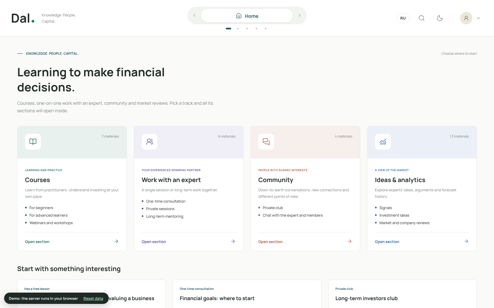
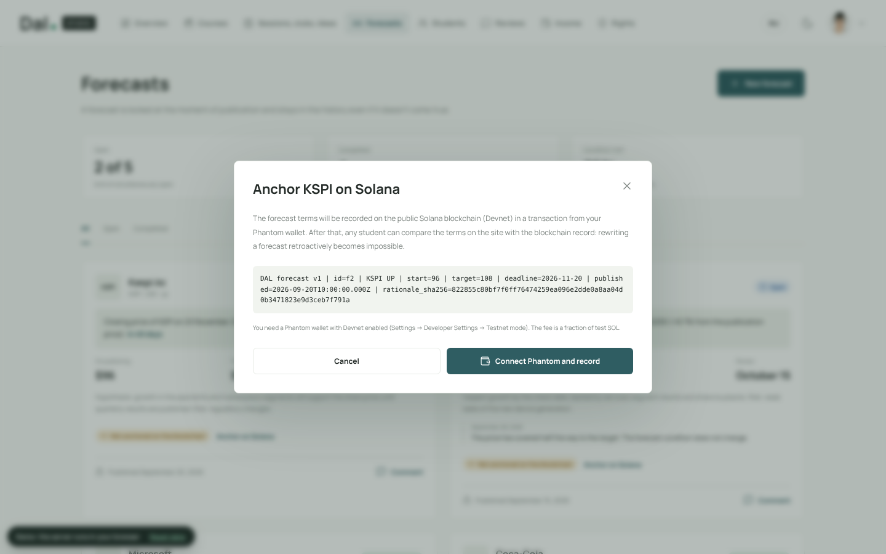
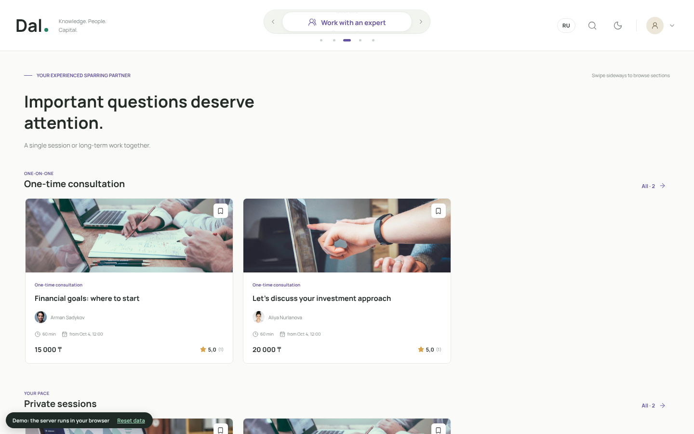
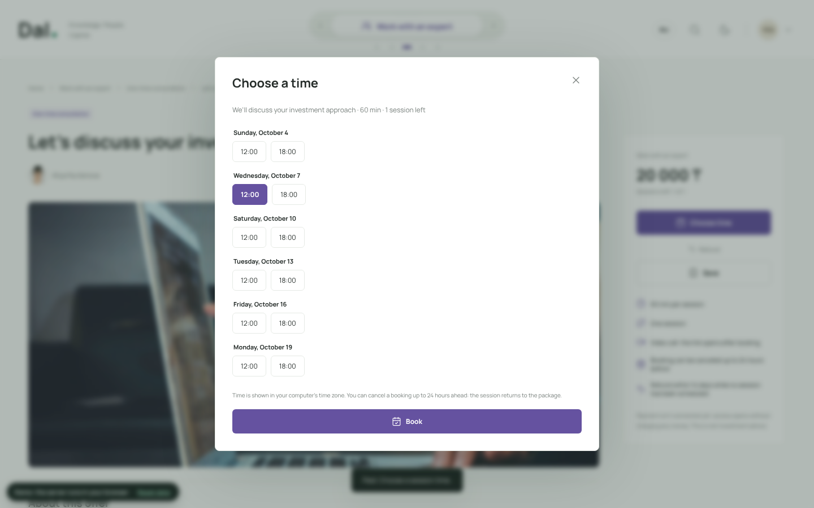
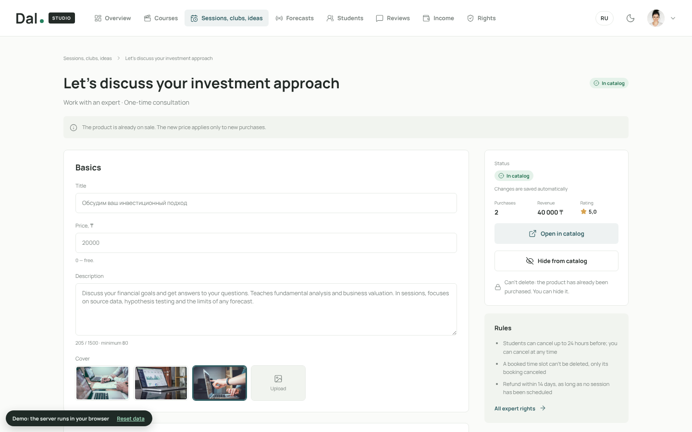
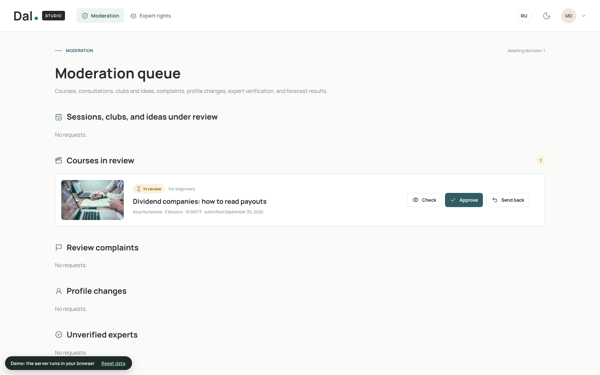

# Dal — Investment Knowledge Marketplace with Verifiable Forecasts on Solana

[](https://github.com/Dikossia/DAL/actions/workflows/ci.yml)
[](LICENSE)
[](https://solana.com)
[](https://colosseum.org)

> A marketplace where investment experts in Kazakhstan sell courses, 1:1 consultations, paid clubs and research notes — and students choose an expert by a **verifiable track record**. Forecasts, course certificates and payments use **Solana** under the hood: users never need a wallet, crypto or blockchain terms, yet every record can be checked by anyone.

[Live Demo](https://dal-kappa.vercel.app/?lang=en) · [Video Walkthrough](#resources) · [Docs](docs/)

**Demo accounts** (password for all: `dal-demo-2026`): `student@dal.local` — student, `aliya@dal.local` — expert, `moderator@dal.local` — moderator. The demo runs fully in the browser — no installation needed.

---



---

## Submission to 2026 Solana National Hackathon

| Name | Role | Contact |
|------|------|---------|
| Diana Abdrakhmanova | Founder & Developer (KBTU, Computer Science) | [GitHub](https://github.com/Dikossia) |

---

## Problem and Solution

### 1. Expert results can't be verified
- **Problem:** A private investor pays for courses, signals and private chats but can't check how good an expert really is: failed forecasts get deleted, and terms get "clarified" after the fact.
- **Dal:** Every forecast is locked on publication (ticker, direction, start price, target, deadline, rationale hash) and anchored on Solana with a Memo transaction. Anyone can compare the terms on the site with the on-chain record.

### 2. Reviews can be faked or edited
- **Problem:** Course reviews on typical platforms can be written before taking the course, edited later or quietly removed.
- **Dal:** A course review can be left **only after completing all lessons**, only **once**, and can't be edited (database triggers). The author can anchor it on Solana: rating, course and the SHA-256 of the text go on-chain.

### 3. An expert's business is scattered across platforms
- **Problem:** Courses on one site, consultations in a messenger, the club in Telegram, payments by hand — clients and reputation are spread out.
- **Dal:** One platform with four directions — **Courses**, **Work with an Expert** (consultations, packages, mentorship with schedule booking), **Community** (clubs and chats with subscriptions), **Ideas & Analytics** (paid notes and forecasts) — and one expert rating.

### 4. Blockchain is scary for ordinary people
- **Problem:** Wallets, seed phrases, buying SOL and gas fees stop people who just want to learn.
- **Dal:** Users sign up with email and use Dal like any website. A **built-in wallet** is created automatically when it is first needed and is tied to the account (it survives a password reset). DAL signs and pays every network fee; the buyer only sees one fixed **5 ₸ network fee** per order that uses the blockchain.

### 5. Reputation mixes teaching and investing
- **Problem:** A great teacher isn't necessarily a great forecaster, and vice versa.
- **Dal:** Ratings are calculated separately for each direction from student reviews; forecast statistics are shown separately from teaching reviews.

---

## Three Solana features, invisible to the user

| Feature | What the user does | What happens under the hood |
|---|---|---|
| **Predictions** | The expert fills in ticker, target, date and rationale and presses **Publish prediction** | DAL writes the terms and the **resolution rule** (`close(TICKER, date) >= target`) to Solana in a Memo transaction paid by DAL and co-signed by the expert's built-in wallet. After the deadline the outcome is computed by that rule and recorded as a second transaction that references the first. Terms and outcomes can't be edited or deleted (database triggers + the public ledger). Network fee: 5 ₸ per prediction, deducted from the expert's income. |
| **Certificates** | The student completes the last lesson | A certificate is issued immediately (view, **PDF download**, verification link). In the background DAL mints an **NFT (Metaplex Core)** to the student's built-in wallet, with a Memo record of the course, date and a SHA-256 of the student's name (the full name is not put on the public ledger). The public **verify page** checks the NFT and the record directly on Solana — no sign-in, no wallet. |
| **Payments** | The buyer sees the full cost before paying: price, DAL commission (included), the expert's share, the **5 ₸ network fee** and the total | Card payments are simulated in the prototype. **USDC on Solana** (beta, devnet): one transaction splits the amount — the expert's share to the expert's built-in wallet, the commission and the fee to DAL. DAL is the fee payer; access opens after DAL checks the amounts on-chain. |

**Reliability.** Every business action is saved first; the Solana record is queued and written by a background worker with retries. If the network is slow or down, publishing, buying and learning keep working, and the record appears later ("being recorded on Solana" → "recorded · verify").

**Account recovery.** "Forgot your password?" sends a one-time code (shown on screen in the demo, emailed in production). The wallet is encrypted with the platform key and linked to the account, so certificates and records stay. Advanced users can export the wallet key (after re-entering the password) and open it in Phantom.

**Economics, measured on Solana devnet** (1 SOL ≈ 53,500 ₸ on 3 Oct 2026):

| Record | Real cost | In tenge |
|---|---|---|
| Prediction terms or result (Memo, 2 signatures) | 0.00001 SOL | ≈ 0.5 ₸ |
| NFT certificate (Metaplex Core asset + Memo) | 0.00299 SOL (mostly the storage deposit) | ≈ 160 ₸ |
| USDC payment (DAL as fee payer) | 0.00001 SOL, +0.002 SOL once per new token account | ≈ 0.5 ₸ (+110 ₸ once) |

The 5 ₸ fee covers transaction fees with a margin, but not the one-time storage deposit of an NFT, so certificates are covered from DAL's 20% commission. The moderator's dashboard shows fees collected vs. SOL actually spent per record type, so the fee can be adjusted (one constant in `server/src/rules.ts`). Devnet test transactions: [prediction memo](https://explorer.solana.com/tx/26XAv5tDwojXfUgj3vpyq4EAGe77Y6a3yJcrXqaqA4kQL1sYj1NhHUZS88fy3qKeaMm9fz5BgyXr74YL71rF1F7p?cluster=devnet), [NFT certificate](https://explorer.solana.com/tx/4D7E6Ge7G9MSJkijmgxkbHDi3KhfyoQiJ8bruJXSje1R9hi5pKKwmBN8KCHvkK5A8SR5ybp8rMMfMbvGH5vnowdi?cluster=devnet).

## Why Solana

- **Cost** — a record costs a fraction of a tenge, so every prediction and result can be recorded, not just a few
- **Speed** — confirmed in seconds, while the expert or student is still on the page
- **Public verification** — any visitor's browser reads the record from a public RPC node; no trust in Dal's server is required
- **Fee payer + co-signers** — DAL pays for users and the user's wallet still signs, so nobody needs SOL
- **Metaplex Core and USDC** — a one-account NFT standard for certificates and a stablecoin for payments with an automatic split in one transaction



---

## Summary of Features

- Catalog of four directions with search, shelves and expert pages with per-direction ratings
- Video lessons in order, progress tracking, refunds by the rules (within 14 days, less than 20% completed)
- **Questions and comments under each lesson**, answered by the course expert
- **Course review only after completion, one per course, immutable, anchorable on Solana**
- **Certificates issued automatically on completion: NFT, PDF and a public verification page**
- **Checkout with the full price breakdown** (price, DAL commission, expert's share, 5 ₸ network fee, total) and an optional USDC payment split on-chain
- **Built-in wallet** in the profile, account recovery by code, optional key export
- **Blockchain cost report** for the moderator: fees collected vs. SOL spent
- Consultation booking from the expert's weekly schedule, cancellation up to 24 hours ahead
- Clubs and chats with 30-day subscriptions, renewal and live chat
- Paid ideas with a preview before purchase
- **Predictions recorded on Solana automatically**, with the resolution rule and the outcome; a "verify" button for every visitor
- Optional "Connect your own wallet" in the profile for crypto users (Phantom on Devnet, needed only for USDC payments) — not shown in the header, so newcomers never see crypto prompts
- Dal Studio for experts: courses with video upload, 7 product types, schedule, forecasts, students, reviews, income
- Moderation: courses and products before publication, review complaints, expert verification, forecast results
- English and Russian interface, light and dark themes, responsive layout

| | |
|---|---|
|  |  |
|  |  |

---

## Tech Stack

| Layer | Technology |
|-------|-----------|
| On-chain | Solana Devnet · Memo · Metaplex Core (NFT) · SPL Token + Associated Token Account (USDC) |
| Solana layer | Plain TypeScript, no SDK (`server/src/chain/`): Ed25519, transaction building, PDAs, JSON-RPC, a background queue with retries |
| Wallets | Built-in custodial wallets (encrypted with the platform key) · DAL issuer wallet as fee payer · Phantom optional |
| Frontend | HTML · CSS · JavaScript, no frameworks · Lucide icons |
| Backend | Node.js 22.18+ · TypeScript (type stripping) · zero dependencies |
| Database | SQLite (`node:sqlite`) · migrations · triggers for immutability rules |
| Browser mode | Same server code bundled with esbuild · sql.js (SQLite in WebAssembly) · IndexedDB · Service Worker |
| Hosting | Vercel (static) |
| Testing | `node --test` — 48 scenarios on roles, rules and Solana flows (with a fake Solana node) · GitHub Actions |

---

## Architecture

```
┌───────────────────┐  ┌──────────────────┐  ┌──────────────┐
│ Student site      │  │ Dal Studio       │  │ Login        │
│ index.html, app.js│  │ studio.html/.js  │  │ login.html   │
└─────────┬─────────┘  └────────┬─────────┘  └──────┬───────┘
          └──────────────┬──────┴───────────────────┘
                         ▼
                  ┌─────────────┐   local mode   ┌─────────────────────────┐
                  │   api.js    │───────────────▶│ Node.js server/ +       │
                  └──────┬──────┘                │ SQLite + video files    │
                         │ browser mode (Vercel) └─────────────────────────┘
                         ▼
             ┌────────────────────────────┐
             │ web/engine.js              │  same server code,
             │ sql.js + IndexedDB + sw.js │  runs in the browser
             └────────────────────────────┘

Business action ──▶ SQLite (saved immediately) ──▶ chain_jobs queue
                                                        │ background worker, retries
                                                        ▼
               DAL issuer wallet (fee payer) + user's built-in wallet (co-signer)
                                                        │
                                                        ▼
                      Solana: Memo records · Metaplex Core NFT · USDC split
                                                        ▲
verify.html / "verify" buttons ── getTransaction / getAccountInfo (public RPC, no wallet)
```

See [docs/architecture.md](docs/architecture.md) for the full component breakdown and the format of Solana records.

---

## Quick Start

**Prerequisites:** Node.js 22.18+ (Node.js 24 LTS recommended). No other dependencies.

```bash
# Clone the repository
git clone https://github.com/Dikossia/DAL
cd DAL/server

# Start the server (the first launch creates the database with demo data)
npm start

# Run tests
npm test

# Restore demo data
npm run reset
```

Then open <http://localhost:4000> (student site), <http://localhost:4000/studio.html> (Dal Studio), <http://localhost:4000/docs> (API docs).

**Try the Solana features** (no wallet needed):
- Prediction: `aliya@dal.local` → Dal Studio → Forecasts → New forecast → **Publish prediction**. In a few seconds the card shows "Anchored on Solana · verify".
- Certificate: `student@dal.local` → My learning → **My certificates** (the course "Portfolio in practice" is already completed in the demo data) → Download PDF / Open verification.
- Checkout: open any paid course → **Get access** → see the price breakdown and the 5 ₸ network fee.
- Blockchain costs: `moderator@dal.local` → Dal Studio → Moderation → "Blockchain: fees and costs".
- Recovery: sign-in page → **Forgot your password?**

**Server settings** (environment variables, all optional): `DAL_SOLANA_CLUSTER` (`devnet`), `DAL_SOLANA_RPC`, `DAL_SOLANA_SECRET` (issuer wallet, base58; the demo uses a devnet-only key), `DAL_WALLET_KEY` (encrypts built-in wallets), `DAL_PUBLIC_URL`, `DAL_USDC_MINT`, `DAL_CHAIN=off` (keep records queued), `DAL_SHOW_RECOVERY_CODES=off` (production).

After changing server code, rebuild the browser version: `node web/build.mjs` (requires esbuild). To publish your own copy, import the repository into [Vercel](https://vercel.com) (Framework: Other, no build command).

---

## Roadmap

- [x] Marketplace with four directions and per-direction expert ratings
- [x] Dal Studio for experts and moderation
- [x] Forecasts anchored on Solana Devnet with public verification
- [x] Course reviews after completion: immutable, anchored on Solana
- [x] Lesson Q&A with expert answers
- [x] Full backend running in the browser (Vercel demo)
- [ ] Card and Kaspi payments, expert payouts
- [x] Predictions recorded on Solana automatically, with a fixed resolution rule and the outcome
- [x] NFT certificates on completion with PDF and public verification
- [x] Built-in wallets, DAL as fee payer, 5 ₸ network fee, cost report, account recovery
- [x] USDC payment with an automatic expert / platform split in one Solana transaction (devnet beta)
- [ ] Automatic forecast resolution with Pyth price feeds
- [ ] Compressed NFTs to cut the certificate cost, club passes on Solana
- [ ] Wallet keys in a KMS/HSM, email delivery of recovery codes
- [ ] Mainnet, Kazakh language, servers in Kazakhstan

Full roadmap: [docs/roadmap.md](docs/roadmap.md)

---

## Resources

- [Live Application](https://dal-kappa.vercel.app/?lang=en)
- [Video Demo](#) <!-- TODO: add the demo video link -->
- [Project Presentation](#) <!-- TODO: add the presentation link -->
- [Server and API documentation](server/README.md)

---

## Prototype Limitations

Demo experts, prices, reviews and forecasts are fictional; profile photos are illustrative. Card payments are simulated: access is granted without charging money. All blockchain records use the Solana Devnet test network; the demo issuer key is devnet-only. In the browser demo the "server" (and the issuer key) runs in your browser; in production these run on the server. The platform does not provide investment advice.

Photos: Unsplash. Font: Manrope (SIL OFL). Icons: Lucide (ISC). SQLite in the browser: sql.js (MIT).

---

## License

MIT — see [LICENSE](LICENSE)
