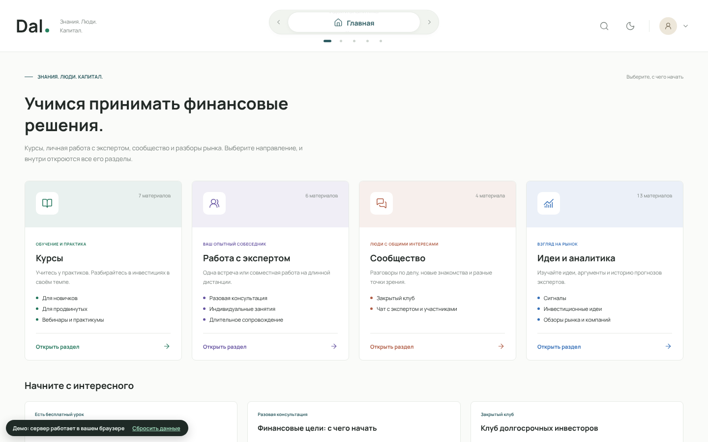
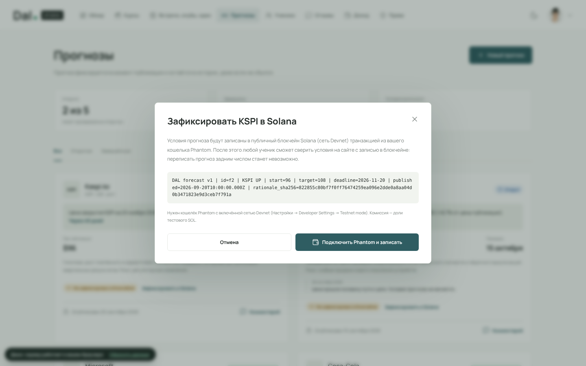
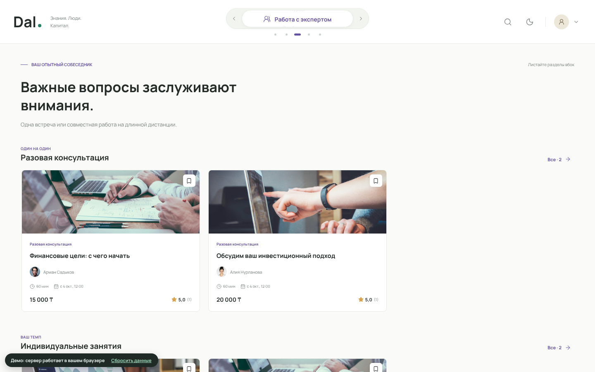
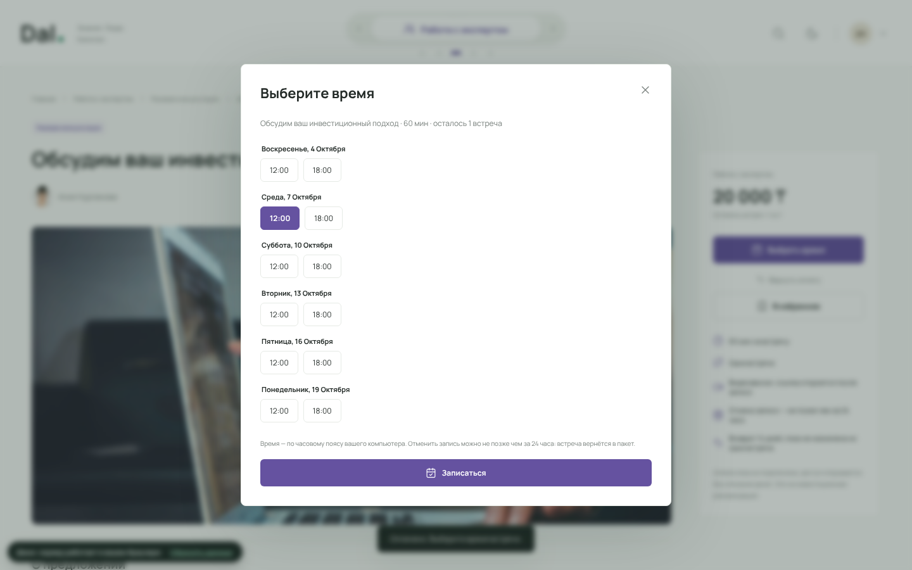
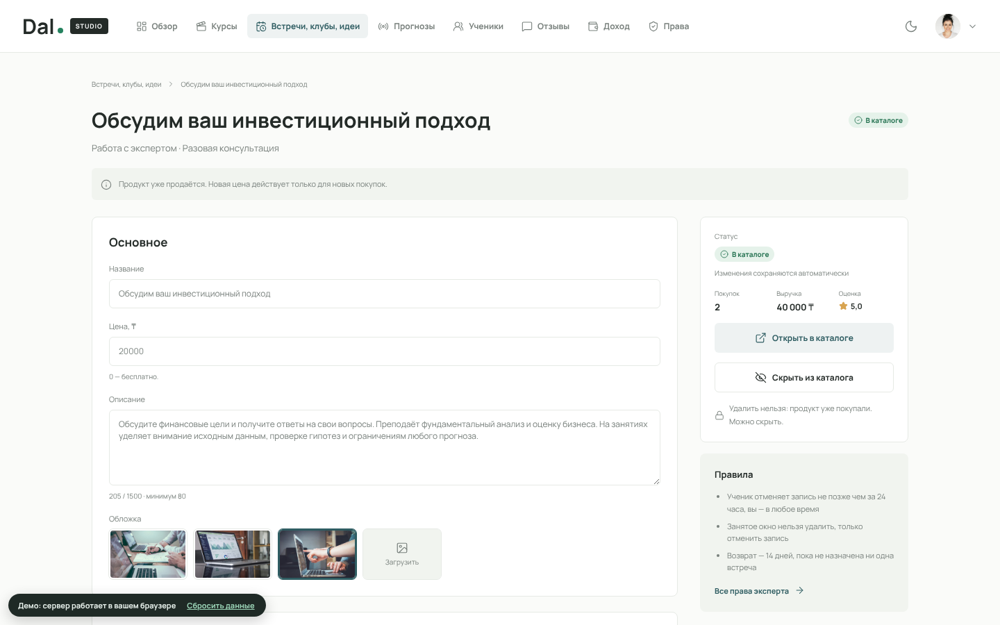
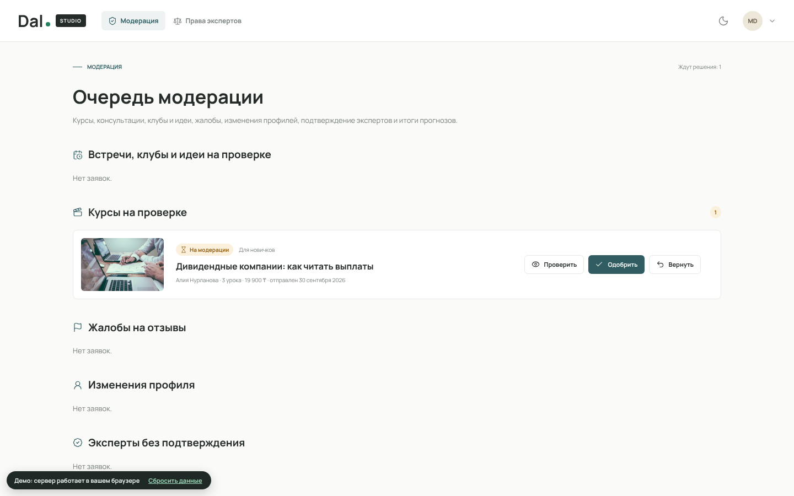

# Dal — маркетплейс знаний об инвестициях с проверяемыми прогнозами на Solana

**Dal** — платформа, на которой инвесторы и эксперты продают свои образовательные, аналитические и консультационные продукты, а ученики выбирают эксперта по честной истории его результатов. Прогнозы экспертов фиксируются в блокчейне **Solana**: переписать неудачный прогноз задним числом нельзя, и любой может это проверить.

> **Демо:** https://dal-kappa.vercel.app — открывается в браузере, установка не нужна.
> Вход: `student@dal.local` (ученик), `aliya@dal.local` (эксперт), `moderator@dal.local` (модератор). Пароль у всех: `dal-demo-2026`.
> Язык сайта: кнопка **EN / RU** в шапке (или `?lang=en` в адресе). English README: [README.md](README.md).

*English summary: Dal is a marketplace where investment experts sell courses, 1:1 consultations, paid clubs/chats and research notes. Every expert forecast can be anchored on Solana (devnet) via a Memo transaction signed in Phantom, so students can verify that the terms were never rewritten. The whole backend (Node.js + SQLite) also runs fully in the browser, so the live demo needs no server.*



## Проблема

- Частный инвестор платит за курсы, сигналы и закрытые чаты, но **не может проверить**, насколько эксперт действительно хорош: неудачные прогнозы удаляются, условия «уточняются» задним числом.
- Эксперту нужно несколько площадок сразу: курсы на одной, консультации в мессенджере, клуб в Telegram, оплата вручную. Клиенты и репутация разбросаны.

## Решение

Одна платформа с четырьмя направлениями и единым рейтингом эксперта:

| Направление | Что продаёт эксперт | Как получает ученик |
|---|---|---|
| **Курсы** | Видеоуроки: для новичков, продвинутые, практикумы | Бесплатные уроки до покупки, уроки по порядку, прогресс |
| **Работа с экспертом** | Разовая консультация, пакет занятий, длительное сопровождение | Запись на время из расписания эксперта, ссылка на звонок, отмена за 24 часа |
| **Сообщество** | Закрытый клуб, чат с экспертом | Подписка на 30 дней с продлением, живой чат участников |
| **Идеи и аналитика** | Инвестиционные идеи, обзоры, **прогнозы (сигналы)** | Отрывок до покупки, полный текст после; журнал прогнозов с итогами |

**Рейтинг учителя** считается отдельно по каждому направлению по отзывам учеников, общий рейтинг — среднее по направлениям. Статистика прогнозов показывается отдельно от отзывов об обучении.

## Где здесь Solana

Прогноз — главное, что отличает эксперта. Поэтому его условия записываются в блокчейн:

1. Эксперт публикует прогноз: тикер, направление, цена при публикации, цель, дата проверки, обоснование. На сервере прогноз уже нельзя изменить или удалить (это охраняют триггеры базы данных).
2. Кнопка **«Зафиксировать в Solana»** собирает транзакцию программы **Memo** с условиями прогноза и хешем SHA-256 обоснования. Эксперт подписывает её в кошельке **Phantom**, транзакция уходит в **Solana Devnet**.
3. У прогноза появляется отметка **«Зафиксирован в Solana · проверить»**. Любой ученик нажимает её: сайт читает транзакцию из публичного узла Solana и сравнивает записанные условия с теми, что показаны на сайте. Совпадение подтверждает, что условия не переписаны после публикации.

Транзакция собирается вручную, без библиотек (`web/solana.js`), поэтому для фиксации и проверки не нужен сервер. Блокчейн подтверждает неизменность условий, но не правильность прогноза: итог определяется по цене закрытия на дату проверки.

**Так же фиксируются отзывы о курсах.** Оценить курс ученик может только после прохождения всех уроков и только один раз: отзыв нельзя изменить или удалить (триггеры базы). Под своим отзывом автор нажимает **«Зафиксировать в Solana»**: в транзакцию Memo попадают id отзыва, курс, оценка и SHA-256 текста (сам текст в блокчейн не пишется), подпись — в Phantom ученика. У отзыва появляется отметка **«Зафиксирован в Solana · проверить»**. Обычные вопросы и комментарии — отдельно, под каждым видеоуроком, там же отвечает эксперт.



**Чтобы попробовать:** установите [Phantom](https://phantom.app), включите Devnet (Настройки → Developer Settings → Testnet mode), возьмите тестовые SOL на [faucet.solana.com](https://faucet.solana.com). Затем войдите как `aliya@dal.local` → Dal Studio → «Прогнозы» → «Зафиксировать в Solana». Для отзыва: войдите как `student@dal.local` → курс «Портфель на практике: открытый разбор» (в демо-данных уже пройден) → «Оставить отзыв» → «Зафиксировать в Solana».

## Подключение кошелька (Phantom)

- Кнопка **«Подключить кошелёк»** в шапке сайта ученика и Dal Studio: подключает Phantom, показывает адрес, баланс в Solana Devnet, кнопку **«Получить 1 тестовый SOL»** и ссылку на Solana Explorer.
- Тем же кошельком эксперт подписывает фиксацию прогноза: **Dal Studio → «Прогнозы» → «Зафиксировать в Solana»**. Ученик подписывает свой отзыв о курсе: **страница курса → ваш отзыв → «Зафиксировать в Solana»**.
- В коде:
  - `web/solana.js`: `connect()` (Phantom), `anchor()` (сборка Memo-транзакции и `signAndSendTransaction`), `verify()` (чтение транзакции через публичный RPC Devnet), кнопка кошелька в конце файла;
  - на сервере: `server/src/anchor.ts`, методы `POST /studio/forecasts/:id/anchor` и `POST /reviews/:id/anchor`, миграции `server/migrations/003_solana.sql` и `004_reviews_chain.sql`, тесты `server/tests/anchor.test.ts` и `server/tests/learning.test.ts`.

## Что уже работает

**Ученик** — каталог всех направлений с горизонтальными полками, поиск, покупка (оплата пока условная), уроки с видео и прогрессом, вопросы и комментарии под каждым уроком с ответами эксперта, запись на консультации и отмена, клубы с чатом и продлением, идеи с платным доступом, отзывы, возвраты по правилам, избранное, рейтинг экспертов, страница эксперта с соцсетями и рейтингом по направлениям, проверка прогнозов в Solana.




**Эксперт (Dal Studio)** — курсы с загрузкой видео и чек-листом перед модерацией; консультации, клубы, чаты, идеи и обзоры (7 типов продуктов) с ценой, длительностью, пакетом встреч, сроком подписки и условиями доступа; расписание окон с повтором по неделям и записями учеников; чат клуба; прогнозы с лимитами и фиксацией в Solana; ученики, отзывы и ответы, доход с комиссией платформы, профиль с соцсетями и фото; страница прав эксперта.



**Модератор** — проверка курсов (с просмотром видео) и продуктов перед публикацией, жалобы на отзывы, изменения имени и стажа экспертов, подтверждение экспертов, итоги прогнозов.



**Правила, которые охраняет сервер:**
- прогноз нельзя изменить или удалить, не больше 5 открытых, по тикеру — один открытый;
- купленный курс или продукт нельзя удалить, только скрыть;
- отзыв о курсе — только после прохождения всех уроков, один на курс; оценку и текст изменить нельзя, автор может зафиксировать его в Solana;
- отзыв не удаляется, только скрывается модератором по жалобе;
- занятое окно расписания нельзя удалить;
- возврат курса — до 14 дней, если пройдено меньше 20%; возврат встреч — до 14 дней, пока ни одна не назначена;
- продавать и публиковать прогнозы может только подтверждённый эксперт;
- эксперт не видит контакты учеников.

## Как это устроено

```
Сайт ученика (index.html, app.js)   Dal Studio (studio.html, studio.js)   Вход (login.html)
                 \                              |                          /
                  api.js ── обычный режим ──> сервер Node.js (server/) + SQLite + файлы видео
                     \
                      ── режим «сервер в браузере» ──> web/engine.js: тот же код сервера + SQLite (WebAssembly)
                                                      данные в IndexedDB, видео и картинки — через sw.js
web/solana.js ──> Phantom (подпись) ──> Solana Devnet: транзакция Memo с условиями прогноза или отзывом о курсе
```

- **Сервер** — Node.js + TypeScript без внешних зависимостей, встроенный SQLite, 42 автотеста (`server/`, подробности в `server/README.md`).
- **Режим «сервер в браузере»** — для демо на Vercel. Код сервера из `server/src` собирается в `web/engine.js`, база работает через [sql.js](https://github.com/sql-js/sql.js) (SQLite в WebAssembly, MIT). Включается сам, если сайт открыт не с `localhost`. Данные хранятся в браузере проверяющего; кнопка «Сбросить данные» возвращает демо-набор.
- **Фронтенд** — HTML, CSS и JavaScript без фреймворков, адаптивная вёрстка, светлая и тёмная темы, русская и английская версии (`web/i18n.js`, словарь `web/i18n-en.js`).

## Запуск

**В браузере (как на Vercel):** откройте ссылку на демо. Чтобы опубликовать свою копию — импортируйте репозиторий на [vercel.com](https://vercel.com) (Framework: Other, без сборки).

**С сервером на своём компьютере:**
1. Установите Node.js 22.18 или новее (рекомендуется 24 LTS).
2. Выполните:
   ```bash
   cd server
   npm start          # первый запуск сам создаст базу с демо-данными
   npm test           # автотесты
   npm run reset      # вернуть демо-данные
   ```
3. Откройте <http://localhost:4000> (сайт), <http://localhost:4000/studio.html> (Dal Studio), <http://localhost:4000/docs> (документация API).

После изменения кода сервера браузерную версию пересобирают командой `node web/build.mjs` (нужен esbuild).

## Структура

| Путь | Что внутри |
|---|---|
| `index.html`, `app.js`, `styles.css` | Сайт для учеников |
| `studio.html`, `studio.js`, `studio.css`, `studio-data.js` | Dal Studio и модерация, права эксперта |
| `login.html`, `login.js` | Вход и регистрация |
| `api.js` | Клиент API для обоих режимов |
| `server/` | Сервер: маршруты, правила, миграции базы, демо-данные, тесты |
| `web/` | Сервер в браузере (`engine.js`, `dal-local.js`, sql.js) и Solana (`solana.js`) |
| `sw.js` | Отдаёт видео, обложки и фото в режиме «сервер в браузере» |
| `data.js` | Направления, категории и демо-контент |
| `Dal.html`, `Studio.html`, `demo/` | Ранние автономные макеты |
| `docs/screenshots/` | Скриншоты для README |

## Что дальше

- Оплата картами и Kaspi с чеками, выплаты экспертам; оплата в USDC с автоматическим разделением суммы между экспертом и платформой одной транзакцией Solana.
- Автоматическая проверка итогов прогнозов по оракулу цен (Pyth) вместо ручного ввода модератором.
- Непередаваемые сертификаты об окончании курса в Solana и цифровые пропуска в клубы на срок подписки.
- Отметка «покупка подтверждена» рядом с отзывом.
- Уведомления, казахский язык интерфейса, развёртывание сервера в Казахстане.

## Ограничения прототипа

Демо-эксперты, цены, отзывы и прогнозы вымышлены, портреты иллюстративные. Оплата не подключена: доступ открывается без списания денег. Прогнозы фиксируются в тестовой сети Solana Devnet. Платформа не даёт инвестиционных рекомендаций.

Фотографии: Unsplash. Шрифт: Manrope (SIL OFL). Иконки: Lucide (ISC). SQLite в браузере: sql.js (MIT).
